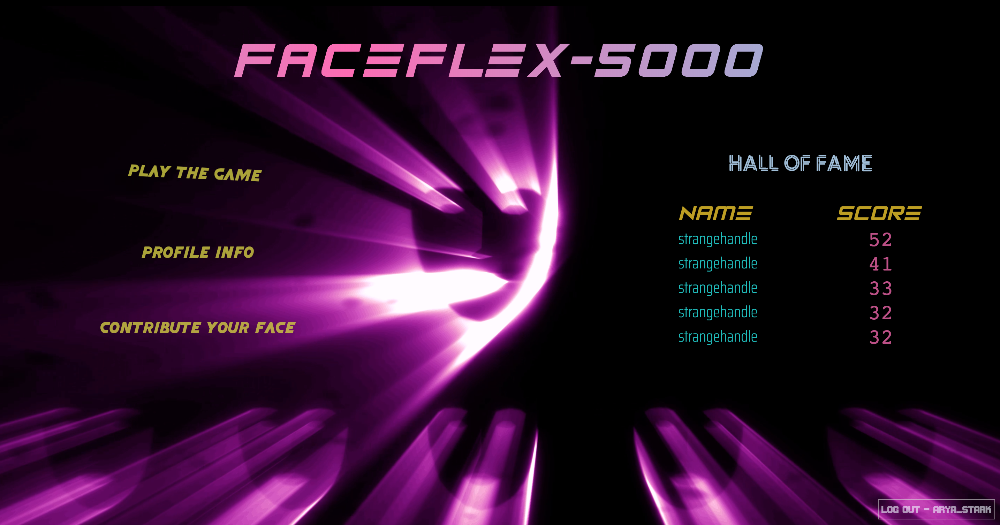
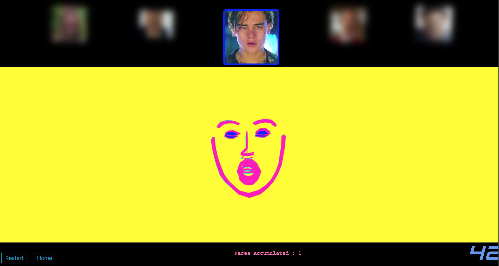

## FACEFLEX 5000

This is a web app that I made for fun utilizing React and facial expression recognition. The goal is simple - match as many facial expressions as you can in a minute's time and see if you can make it to the coveted **HALL OF FAME**. 

For the facial expression recognition, there are 6 expressions that are recognized (in ascending order of difficulty, according to my personal experience). Listed next to each is it's associated in-game color  - 

* Happiness (light blue)
* Anger (red)
* Surprise (yellow)
* Sadness (dark blue)
* Fear (purple)
* Disgust (green)

For best results, believe in yourself. Also, make your faces in a well lit environment. :-)

## Screenshots

---

---

---

## Tools Used

* Background Animation

I made the background video loop myself using Adobe After Effects. For more examples of my video art, checkout my [website](www.StrangeHandle.com). :-)

* Facial Expressions

For the facial recognition features, I used [face-api.js] (https://github.com/justadudewhohacks/face-api.js), which is a facial recognition API written for the browser by JustADudeWhoHacks. It's incredibly well documented and is based upon the [Tensorflow machine learning API](https://github.com/tensorflow/tfjs-core). 

* User Authentication

I used [Google Firebase](https://firebase.google.com/) for user email authentication. I plan on doubling back and building this out a bit in the future. 

* Styling 

For the modals I used [Reactstrap](https://github.com/reactstrap/reactstrap)

For text animation, I used the amazingly quirky [CSShake](https://elrumordelaluz.github.io/csshake/)

